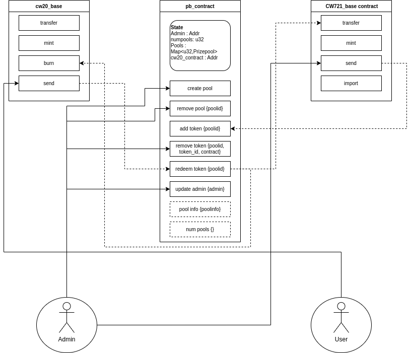

# Prizebooth Smart Contract
Prizebooth smart contract is the smart contract used for managing the Ostrich Studios Prizebooth. It is written in CosmWasm, a multi-chain smart contract platform in rust. 

**Note: this is still highly WIP and is not to be used for production.**

## Architecture(WIP)


The whole prizebooth contract consists of 4 contracts:
1. The prizebooth contract 
1. cw20_base contract for handling tokens
1. cw721_base for handling NFTs to be minted on home chain
1. ics721 bridge contract for handling NFTs to be imported from other chains

The Prizebooth has mapping for pool to poolid. Each prizepool is a structure containing its token price (u32) and vector of prizes (token_id, nft_contract_address). The prizebooth also stores an ADMIN address, which is the address that can add new pools and prizes, as well as delete them. The process of adding a prize to poolid involves sending the NFT to prizebooth with the msg to add it to a poolid. To redeem a prize from a prizepool, I need to send tokens to the prizebooth with the message of redeeming from the specific pool. 

## Compiling and Testing
To compile the contract, run
```
cargo wasm
```
This will compile the contract in the `target` directory. For a much more optimized build, use
```
docker run --rm -v "$(pwd)":/code \
  --mount type=volume,source="$(basename "$(pwd)")_cache",target=/code/target \
  --mount type=volume,source=registry_cache,target=/usr/local/cargo/registry \
  cosmwasm/workspace-optimizer:0.12.6
```

To test the contract, run
```
cargo test
```

## Deploying
To deploy the prizebooth contract, you will need additionally the base ics721 contract, cw20_base contract, and cw721_base contract. You can find the compiled contracts from their respective directories. Deploy and instantiate them on your desired chain. Then while instantiating the prizebooth, give the address of the cw20 contract as well as an admin address. 